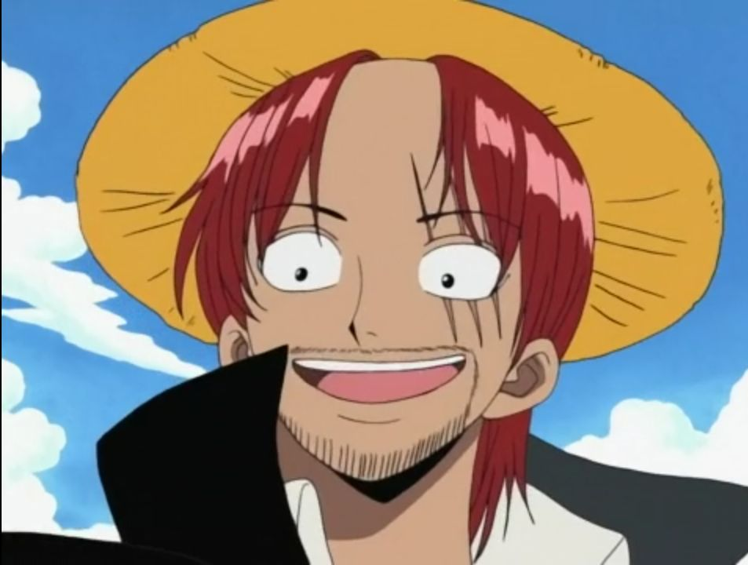

- {{video https://youtu.be/yAtUSvVayM0?si=7bZjd0UxObhPQwly}}
- বিশ বছর আগের কথা। ওয়েলথ, ফেম, পাওয়ার! গোল্ড রজার, কিং অব দ্যা পাইরেট এই ওয়ার্ল্ড এর যা কিছু আছে তা অর্জন করে। পাইরেট কিং **গোল্ড রজার** তার মৃত্যুদণ্ডের আগ মুহুর্তে সমস্ত পৃথিবীর মানুষকে বলে। তুমি চাইলে আমার গুপ্তধন নিতে পার। খুজে নাও। সেখানে আছে আমার অর্জন করা সবকিছু।
- > 
  #+BEGIN_CENTER
  *Photo: Luffy, Zoro, Nami*
  #+END_CENTER
- বর্তমান: একটি রেসিডেন্ট [[শিপ]] 🛳️ এর দুইজন শিপ ক্রু সমুদ্রের তাকিয়ে ছিল, এমন অবস্থায় একটি কাঠের ব্যারেল এসে আঘাত করলো সেই শিপ'এ। ব্যারেলটি তারা শিপ এর উপর উত্তউত্তলন করলো। এমন অবস্থায় হঠাৎ ডুম করে উঠলো। ক্যানোন এর গোলা! পাইরেট! কোন কিছু ভেবে ওঠার আগেই একটি পাইরেট শিপ এসে হাজির। পাইরেটরা পুরো শিপ দখল করে নিয়েছে।
- শিপটি ছিলো পাইরেট আলভিডা এর। একজন মহিলা পাইরেট ক্যাপ্টেন। আলভিডা পাইরেট এর একজন শিপ ক্রু ছিলো [[কোবি]]। বাচ্চা ছেলে! আলভিডা কে খুব ভয় করতো সে। ক্যাপ্টেন আলভিডা কোবিকে অর্ডার দিলো সেই রেসিডেন্ট সিপে গিয়ে লুট করতে।
- শিপ'এ গিয়ে [[কোবি]] ডিস্কভার করলো সেই কাঠের ব্যারেল।
- ব্যারেল থেকে বের হলো আমাদের মেইন ক্যারেক্টার [[লুফি]], এক আলভিডা পাইরেট কে নকআউট এর মধ্যদিয়ে। লাল জামা গায়ে, মাথায় একটি খরের টুপি পড়া (সট্রহ্যাট)।
- {{video https://youtu.be/VwSsMB-BigE?si=Hv1tN9I77hdgj5JN}}
- এর পরে [[লুফি]] এবং [[কোবি]] হালকা চিট/চ্যাট আলোচনা করলো। লুফির কথা শুনে [[কোবি]] অনেকটা মোটিভেট হলো এবং তার [[মারিন]] হওয়ার সপ্ন আরো জেগে উঠলো। এমন সময় পাইরেট ক্যাপটেন আলভিডা তাদের সামনে এসে হাজির। আলভিডা লুফিকে মারার চেষ্টা করলো কিন্তু লুফি অনেক পাওয়ারফুল।
- লুফির কাছে আছে রহস্যময় পাওয়ার। তার সম্পুর্ন দেহ রাবার। লুফি **গোমু গোমু নোমি** (গাম গাম) ডেভিলফ্রুট খেয়েছে। এতে তার সম্পুর্ন দেহ রাবার এর মত হয়ে গেছে। সে চাইলে নিজের হাত, পা লম্বা করতে পারে। অদ্ভুত অদ্ভুত সব হ্যাটাক এর মাধ্যমে শত্রুকে ঘায়েল করে দিতে পারে।
- লুফি তার **গাম গাম পিস্তল** অ্যাটাক দিয়ে আলভিডা কে এক ঘুসিতে হারিয়ে দিল। ঘুসি খেয়ে আলভিডা কয়েক কিলো দুরে গিয়ে পরলো।
  {{video https://youtu.be/gVHCH_BYdtE?si=5ePkTYorCUYnmrZ4}}
  ---
- আলভিডা কে হারিয়ে কোবি এবং লুফি একটি বোট নিয়ে যাত্রা করলো কাছের আইল্যান্ডে, যার নাম শেল টাউন (Shells Town) এটি একটি নেভি বেস। সেখানে গেলে কোবি [[মারিন]] জয়েন করতে পারবে। এবং লুফি সেখানে যাবে কারন সে **[[রোরোনোয়া যোরো]]** নামের একজন কে **[[রিক্রুট]]** করবে। সে সবেমাত্র তার পাইরেট যাত্রা শুরু করেছে। তার নেই কোন শিপ, ক্রু মেম্বার!
- > [[রোরোনোয়া যোরো]] এক কথায় পরিচিত ছিল পাইরেট হান্টার নামে। সোর্ডসম্যান (তলোয়ারবাজ)। সে পাইরেট দের মারত এবং তাদের [[বাউন্টি]] ক্লেইম করতো।
- দুইজনে  শেল টাউন'এ পা রাখার পরে বুঝতে পারলো সেখানকার কমান্ডিং অফিসার [[অ্যাক্স হ্যান্ড মর্গান]] একজন নির্মম সৈরাচারী। লোকজন তার নাম শুনলেই ভয়ে কাপে।
- শেল টাউনে ঘুরতে ঘুরতে এসসময় তারা যোরো কে দেখতে পায়। যে কিনা বাধা আছে খুঁটির সাথে। লুফি যোরোর কাছে গিয়ে তাকে তার পাইরেট ক্রু আমন্ত্রন জানায়। কিন্তু যোরো মানা করে দেয়।
- > {{video https://youtu.be/k26pfhCWpIY?si=4KzaL--u7y0njnVT}} *লুফি: আমরা যদি তাকে মুক্ত করি তাহলে সে এখান থেকে পালাতে পারবে।
  কোবি: তাকে মুক্ত করলে সে তোমাকেই মেরে ফেলতে পারে।
  লুফি: পারবে না। আমি সট্রং।*
- পরবর্তী কালে লুফি ও কোবি টাউনে ঘুরতে গিয়ে জানতে পারে যোরো ৩ সপ্তাহ ধরে সেখানে বাধা আছে কিছু না খেয়ে। কারন 
  অ্যাক্স হ্যান্ড মর্গান এর আহাম্মক ছেলে [[হেলমেপো]] এর বদমাইশিতে বাধা এবং তাকে হালকা করে উচিত শিক্ষা দেওয়ার কারনে এভাবে তাকে বেধে রাখা হয়েছে।
- যোরো অনেক সট্রং তবে সে স্যারেন্ডার করে কারন তানাহলে হেলমেপো সাধারন সিভিলিয়ান কে মেরে ফেলার উমকি দেয়। এবং শর্ত দেয় যদি সে ১ মাস খুটির সাথে বাধা থাকতে পারে তবে তাকে ছেড়ে দেওয়া হবে। কিন্তু আদতে তার পরিকল্পনা হচ্ছে ১ মাস শাস্তি দেওয়ার পরে যোরো'কে মেরে ফেলা।
- এগুলো জানতে পেরে লুফি যোরো'র কাছে আবারও যায় এবং যোরো কে জয়েন করতে বলে। যোরো মানা করতে থাকে। লুফি বলে যদি আমি তোমার [[সোর্ড]] (তলোয়ার) নিয়ে আসি যা জব্দ করা হয়েছে, তাহলে আমার ক্রুতে জয়েন করতে হবে। এই বলে লুফি যোরো'র তলোয়ার আনতে যায়।
- লুফি মারিন বেজ এর মধ্যে অনুপ্রবেশ করে। এবং যোরোর তলোয়ার খুজতে থাকে। এবং তলোয়ার পেয়েও যায়।
- অন্যদিকে কোবি যোরোকে বাঁচাতে আসে এবং খুটির সাথে বেধে রাখার বাধন খুলতে থাকে যোরোকে মুক্ত করার জন্য, কিন্তু কি কপাল। এমন সময় মরগান চলে আসে কয়েক ডজন সৈন্য নিয়ে।
- মরগান যোরোকে ক্রসফায়ারে মারার অর্ডার দিয়ে দেয়। সৈন্যরা ফায়ার করে কিন্তু যোরোর গায়ে বুলেট লাগার আগে লুফি সামনে দারিয়ে যায় যোরোর তলোয়ার উদ্ধার করে।
- সকল বুলেট লুফির গায়ে লেগে বাউন্স হয়ে যায় কারন লুফি রাবারের তৈরি। এভাবে যোরো প্রানে বেঁচে যায়।
- এমন সময়ে অবশেষ যোরো রাজি হয়ে যায় লুফির ক্রুতে জয়েন করার জন্য। এবং দুইজনে মিলে একসাথে ফাইটিং শুরু করে দেয় মরগান এর বিরুদ্ধে।
  ---
- লুফি আর যোরো মিলে 
  অ্যাক্স হ্যান্ড মর্গান কে হারিয়ে দিয়ে সেই নেভি বেস ও শেল টাউন'কে এক সৈরাচার এর হাত থেকে মুক্ত করে। সাধারন সিভিলিয়ান এমনকি নেভি সৈন্য সকলে অনেক খুশি হয় তাদের উপরে।
- {{video https://youtu.be/KEHMNtSw56I?si=i2dGRUZjS6rzMb6z}}
- এরপরে যোরো আরও লুফি কোবিকে বিদায় জানিয়ে তাকে নেভি বেস'এ রেখে পারি দেয় সাগরে। যেহেতু কোবি [[মারিন]] হতে চায়।
  ---
- অনেক আগের কথা। লুফি তখন অনেক ছোট ছিল। সে থাকতো ডন আইল্যান্ড (Dawn Island) এর ফূশা ভিলেজএ। তাদের গ্রামে আগমন হয় **রেড হেয়ার্ড পাইরেটস** এর। রেড হেয়ার্ড পাইরেটস এর ক্যাপটেন এর নাম **শ্যাংকস (Shanks)**। তার চুল গুলো লাল বলেই এই নাম। লুফির অনেক প্রিয় ছিল শ্যাংকস। স্যাংকস কে লুফি ভিষনভাবে শ্রদ্ধা করতো। তারা যেখানে যেত, লুফিও সেখানে যেতে চাইতো।
- > 
  #+BEGIN_CENTER
  *Shanks*
  #+END_CENTER
- লুফি সবসময় বলতো—"আমি বড় হয়ে তোমার মতো পাইরেট হবো!"
- একদিন স্যাংকস ও তার ক্রিকেট এবং লুফি একটি [[বার]]'এ ছিলো। এসময় তাদের কাছে আসে মাউন্টেন ব্যান্ডিট (ডাকাত) এবং তাদের সাথে উল্টাপাল্টা ব্যবহার করতে থাকে কিন্তু স্যাংকস তা হেসে উড়িয়ে দেয়। এগুলো দেখে লুফি খুব রেগে যায়।
- - স্যাংকস, ওদের উচিৎ শিক্ষা দিলে না কেন?
- পরে ফ্রাস্ট্রেশনে এক বাক্স খুলে সেটার মধ্যে থাকা এক ফল খেয়ে ফেলে। এই ফলটি কোন সাধারন ফল ছিলো না! **গোমু গোমু নোমি** যা খেয়ে তার শরীর রাবার এর হয়ে যায়। এবাবেই লুফি তার আশ্চর্য পাওয়ার পায়। কিন্তু এর বিপরীতে চিরদিনের জন্য সাতার কাটার ক্ষমতা হারায়।
- কিছু দিন পরে একই মাউনটেন ব্যান্ডিট (ডাকাত) আবারও আসে। এবার লুফি কিডনাপ করে নিয়ে যায় সমুদ্রে। লুফি অনেক প্রতিরোধ এর চেষ্টা করে। বিরক্ত হয়ে সেই ডাকাত লুফি কে সমুদ্রে ফেলে দেয়। লুফি বহু চেষ্টা করেও সাতার কাটতে পারে না। এমন সময় ভয়ঙ্কর এক প্রানি সমুদ্র থেকে বের হয়ে আসে এবং সেই ডাকাতকে খেয়ে ফেলে।
- 
- সেই প্রানিটি লুফিকে খেতে যাবে এমন সময় শ্যাংকস আসে এবং লুফিকে বাঁচিয়ে নেয়। কিন্তু তার একটি হাত হারায় প্রানিটির কাছে। শ্যাংকস এক রহস্যময় পাওয়ার ব্যবহার করে এতে সেই প্রানি টি ভয়ে পালিয়ে যায়।
- {{video https://youtu.be/-wZuCtZNf7Y?si=x-txADKopH3v9Awh}}
- শ্যাংকস এর উপরে লুফির শ্রদ্ধা আরো বেড়ে যায়। পুনরায় সমুদ্রে পারি দেওয়ার আগে শ্যাংকস তার সট্রহ্যাট (খরের টুপিটি) লুফিকে দিয়ে যায়।
- --> লুফি, এটি আমার অনেক প্রিয়। যেদিন তুমি অনেক বড় পাইরেট হবে সেদিন এই সট্রহ্যাট আমাকে দিবে।
- এই বলে শ্যাংকস ও তার ক্রুরা বিদায় নেয়।
- #+BEGIN_TIP
  এখান থেকে আমরা জানতে পারি লুফি যে সট্রহ্যাট পরে সেটা আসলে শ্যাংকস এর ছিল।
  #+END_TIP